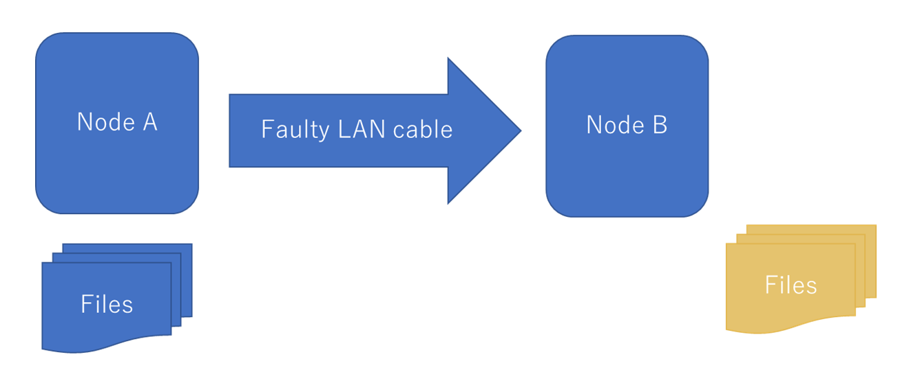
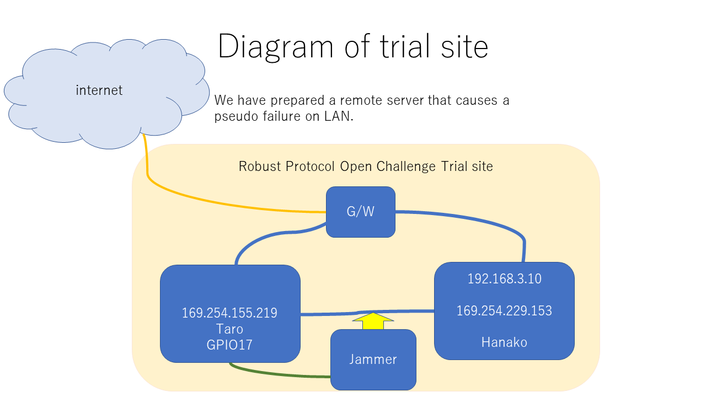
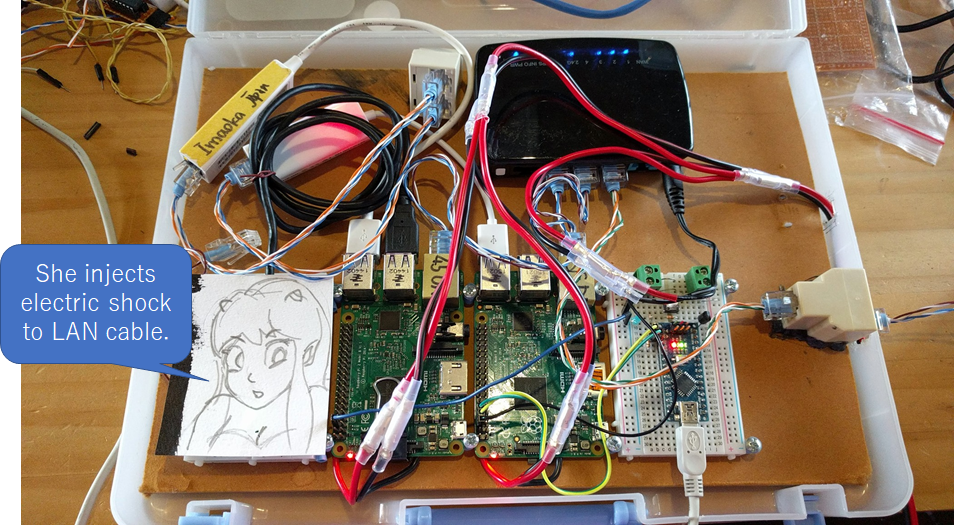

# Introduction of Robust Protocol Open Challenge

## GCC 2021 Online  

### Trainer

Michihiro Imaoka (Hiro) JP  
@imaoca  
imaoca@gmail.com  
https://www.facebook.com/imaoka.micihihiro/

### TAs

Yuya Tsuru  
Naoki Takayama

# Background

In general, cyber security tends to focus on protecting information devices and data from malicious attackers.  
In addition to this, securing communication from accidents and natural disasters is also an important task of cyber security.  
We have designed a contest to compete for skills to accomplish such tasks.  

# What is Robust Protocol Open Challenge

Node A and Node B are connected by a faulty LAN cable.  
Transfer files from node A to B or node B to A.  
Compete for the number of error-free file transfers.  

 

# What is a LAN cable with a  failure

By using Jamming Machine, LAN cable(10BASE-T) causes a pseudo failure.  
The Jamming Machine is located between LAN cables and interferes with communication by injecting electrical noise into the cables.  
The noise pattern and timing are programmable and this time adjusted to about 50% packet loss with Ping examine.  

# Robust Protocol Open Challenge trial site

We have prepared a remote server that causes a pseudo failure on LAN.   
Nodes are constructed by two Raspberry Pi-2.  
You can participate in the contest by logging in with SSH etc.  
The following languages ​​are usable to implement the protocol.  

- gcc version 8.3.0(Raspbian 8.3.0-6+rpi1)  
- go version go1.15.3 linux/arm  
- Python 2.7.16  
- Python 3.7.3  
- Rust  

# Diagram of trial site

 

# Photo of Robust Protocol Challenge trial site

# Scoring method

After the time limit, we are checking the files that has been saved inside the receiving side. Scoring will be done as follows.  
  
\+ 10pts per correct file  
  
\- 10pts per file containing errors  
  
\- 5pts per duplicate file (files with equal content)  

# Show Time (time table assuming for 8 teams)

[3hour = 180min]  
[10min] Opening  
[20min / 1 team] 8 teams  
[4min] Operator preparation  
[6min] Start of competition  
[10min] Presentation of algorithm (ranking update behind the scenes & operator cleans up)    
[10min] Result announcement & awards ceremony

# Trial site SSH accounts

The trial site is currently available.  
If you want to try it, please send us your SSH public key.  
After creating an account, we will send you your login information. Please contact below.  
  
imaoca@gmail.com  
  
Currently, trial site login rights are only granted to "GCC 2021 Online" participants.
